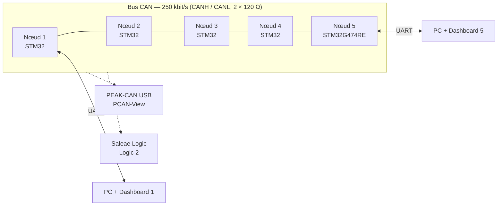
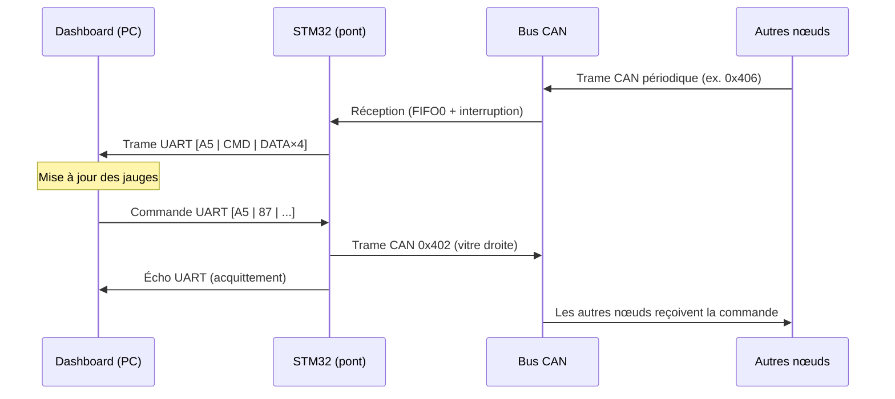
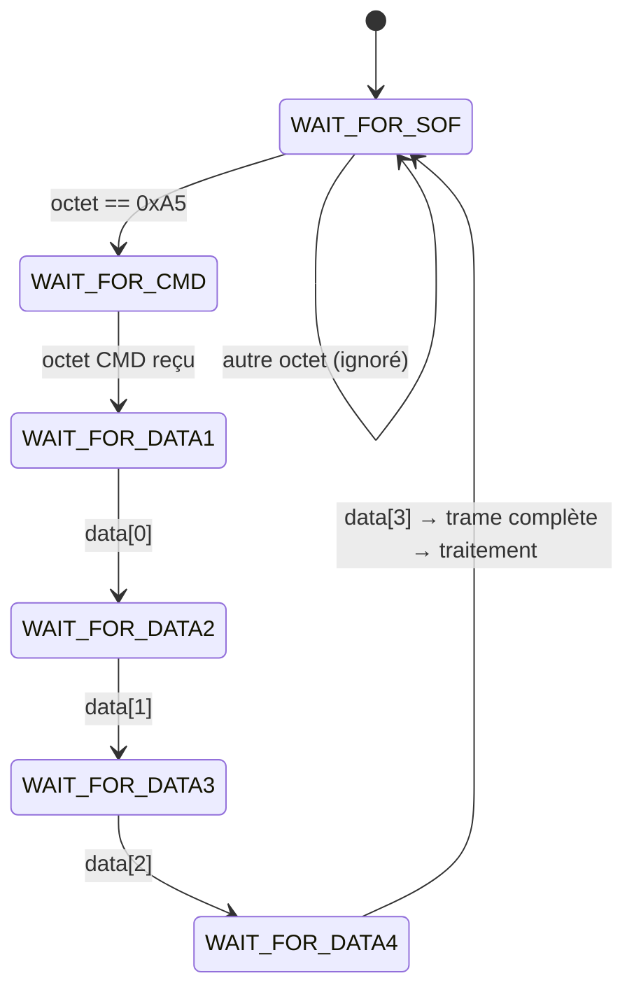

# 🚗 CAN-BUS-STM32 — Réseau CAN multi-nœuds avec dashboard temps réel


-orange)


Réseau de **5 nœuds STM32** communiquant sur un **bus CAN** à la manière des calculateurs d'un véhicule (moteur, ABS, portes, vitres…). Chaque nœud joue aussi le rôle de **passerelle CAN ↔ UART** vers un **dashboard Python** temps réel, avec retour de commandes (ouvrir une porte, fermer une vitre…) qui se traduisent en trames CAN.

[Démo du dashboard](Images/demo.gif)
---

## 📑 Sommaire

1. [Objectif](#-objectif)
2. [Architecture](#-architecture)
3. [Matériel](#-matériel)
4. [Logiciels et outils](#-logiciels-et-outils)
5. [Configuration CAN](#-configuration-can)
6. [Communication](#-communication)
7. [Protocole UART et machine d'états](#-protocole-uart-et-machine-détats)
8. [Identifiants CAN et commandes](#-identifiants-can-et-commandes)
9. [Dashboard Python](#-dashboard-python)
10. [Résultats](#-résultats)
11. [Problèmes rencontrés et solutions](#-problèmes-rencontrés-et-solutions)
12. [Limitations connues et améliorations](#-limitations-connues-et-améliorations)
13. [Démarrage rapide](#-démarrage-rapide)
14. [Structure du dépôt](#-structure-du-dépôt)
15. [Auteur](#-auteur)
16. [Licence](#-licence)

---

## 🎯 Objectif

Réaliser un **réseau de bus CAN représentatif de ce que l'on trouve dans une automobile** :

- échange de messages périodiques entre plusieurs calculateurs (nœuds) ;
- **visualisation en temps réel** des données (température, pression, vitesse moteur, débit d'air, états ABS / portes / vitres…) sur un dashboard via **UART** ;
- **supervision du bus** à tout instant avec **PEAK-CAN (PCAN-View)** et un analyseur logique **Saleae** ;
- **commande à distance** : une action sur le dashboard envoie une commande UART au STM32, qui répond par une trame CAN visible de tous les nœuds.

Ce projet a été réalisé dans le cadre d'un **stage**, et répond à un cahier des charges (SRS – *Software Requirements Specification*).

---

## 🏗 Architecture

- **5 nœuds STM32** reliés sur un même bus CAN (2 fils : CANH / CANL).
- Un **transceiver CAN (MCP2551)** par nœud.
- **Résistances de terminaison** (120 Ω) aux deux extrémités du bus.
- Chaque nœud :
  - **émet périodiquement** sa propre trame CAN ;
  - **reçoit** les trames des 4 autres nœuds (aucun filtrage) ;
  - fait office de **pont CAN ↔ UART** : toutes les trames CAN reçues (et émises) sont retransmises au PC ;
  - **répond par une trame CAN** à la réception d'une commande UART spécifique.
- Chaqu'un de l'équipe dispose de **son propre PC, sa carte et son dashboard**.




*(Chaque nœud dispose de sa liaison UART vers un PC ; seuls deux sont représentés.)*

[Cablage](Images/cablage.jpg)

---

## 🔧 Matériel

| Élément | Quantité | Rôle |
|---|---|---|
| STM32 **NUCLEO-G474RE** | 2 | Nœuds CAN (FDCAN) utilisés en CAN classique |
| STM32 **NUCLEO-F429ZI** | 1 | Nœud CAN |
| STM32 **F476** | 2 | Nœuds CAN |
| Transceiver CAN **MCP2551** | 1 par nœud | Interface physique CAN (CANH/CANL) |
| Résistances de terminaison 120 Ω | 2 | Adaptation d'impédance aux extrémités du bus |
| **PEAK-CAN USB** (PCAN-USB) | 1 | Sniffer / analyse des trames CAN |
| **Analyseur logique Saleae** | 1 | Analyse des signaux (CAN / UART) — *l'appareil « type oscilloscope » numérique* |
| Fils de câblage | — | Liaison du bus et des UART |


---

## 💻 Logiciels et outils

| Outil | Usage |
|---|---|
| **STM32CubeIDE** | Développement firmware, configuration des périphériques (CubeMX), débogage |
| **PyCharm** (Python 3) | Développement du dashboard |
| **PCAN-View** | Visualisation des trames CAN via PEAK-CAN |
| **Saleae Logic 2** | Analyse des signaux CAN / UART |
| **PyQt5 / pyserial** | Interface graphique et liaison série |

---

## ⚙️ Configuration CAN

### Paramètres généraux

- **Mode** : CAN classique (`FDCAN_FRAME_CLASSIC`), mode normal, identifiants standards 11 bits.
- **Débit** : **250 kbit/s**.
- **Filtrage** : **aucun** — filtre masque `ID = 0x000 / MASK = 0x000` → toutes les trames sont acceptées dans la FIFO0.
- **Horloge** : **oscillateur interne HSI** → **PLL** → SYSCLK **80 MHz** ; horloge FDCAN à **40 MHz**.
- Cette configuration est **identique sur tous les nœuds**.

### Code d'initialisation (`MX_FDCAN1_Init`)

```c
static void MX_FDCAN1_Init(void)
{
    hfdcan1.Instance                  = FDCAN1;
    hfdcan1.Init.ClockDivider         = FDCAN_CLOCK_DIV1;
    hfdcan1.Init.FrameFormat          = FDCAN_FRAME_CLASSIC;
    hfdcan1.Init.Mode                 = FDCAN_MODE_NORMAL;
    hfdcan1.Init.AutoRetransmission   = DISABLE;
    hfdcan1.Init.TransmitPause        = DISABLE;
    hfdcan1.Init.ProtocolException    = DISABLE;
    hfdcan1.Init.NominalPrescaler     = 10;
    hfdcan1.Init.NominalSyncJumpWidth = 1;
    hfdcan1.Init.NominalTimeSeg1      = 13;
    hfdcan1.Init.NominalTimeSeg2      = 2;
    hfdcan1.Init.DataPrescaler        = 10;
    hfdcan1.Init.DataSyncJumpWidth    = 1;
    hfdcan1.Init.DataTimeSeg1         = 13;
    hfdcan1.Init.DataTimeSeg2         = 2;
    hfdcan1.Init.StdFiltersNbr        = 1;
    hfdcan1.Init.ExtFiltersNbr        = 0;
    hfdcan1.Init.TxFifoQueueMode      = FDCAN_TX_FIFO_OPERATION;
    if (HAL_FDCAN_Init(&hfdcan1) != HAL_OK)
        Error_Handler();
}
```

### 🕒 Le timing CAN expliqué (Sync Jump Width, Time Segment 1 & 2)

Un bit CAN est découpé en **quanta de temps (TQ)**. Sa durée dépend du prescaler et de l'horloge FDCAN :

```
f_FDCAN = 40 MHz
TQ      = Prescaler / f_FDCAN = 10 / 40 MHz = 250 ns
Bit     = Sync_Seg (1 TQ) + TimeSeg1 + TimeSeg2
        = 1 + 13 + 2 = 16 TQ = 4 µs
Débit   = 1 / 4 µs = 250 kbit/s
```

| Paramètre | Valeur | Rôle |
|---|---|---|
| `NominalPrescaler` | 10 | Divise l'horloge FDCAN pour définir la durée d'un TQ (250 ns) |
| `NominalTimeSeg1` | 13 TQ | Segment avant le point d'échantillonnage (propagation + phase buffer 1) |
| `NominalTimeSeg2` | 2 TQ | Segment après le point d'échantillonnage (phase buffer 2) |
| `NominalSyncJumpWidth` | 1 TQ | Amplitude maximale de **resynchronisation** : de combien de TQ un nœud peut allonger/raccourcir un segment pour se recaler sur le flux de bits reçu |

```
|<-- Sync 1 TQ -->|<------- TimeSeg1 = 13 TQ ------->|<- TimeSeg2 = 2 TQ ->|
                                                       ^
                                              point d'échantillonnage
                                     (1 + 13) / 16 = 87,5 % du bit
```

- Le **point d'échantillonnage à 87,5 %** est une valeur courante recommandée pour le CAN (CiA 301 / automobile) : il laisse le maximum de temps au signal pour se stabiliser sur le bus.
- **SJW = 1 TQ** : c'est la valeur minimale ; elle suffit ici car tous les nœuds utilisent la même source d'horloge interne et le bus est court. Sur un bus plus long ou avec des horloges moins précises, on augmenterait le SJW (toujours ≤ TimeSeg2).
- Les paramètres **`Data*`** (`DataPrescaler`, `DataSyncJumpWidth`, `DataTimeSeg1`, `DataTimeSeg2`) ne concernent que la **phase de données en CAN FD avec Bit Rate Switch**. En **CAN classique** (utilisé ici, `BitRateSwitch = OFF`), ils sont renseignés avec les mêmes valeurs que la phase nominale mais n'ont **pas d'effet** ; ils deviendront utiles en cas de migration vers CAN FD.

> ⚠️ Tous les nœuds du bus doivent partager **exactement le même débit**, sinon les trames sont perçues comme des erreurs.

---

## 📡 Communication

La communication s'effectue en **temps réel** selon trois flux :

| Flux | Description |
|---|---|
| **CAN → CAN** | Chaque nœud émet périodiquement une trame (ex. température ID `0x456` toutes les 500 ms) et reçoit celles des autres |
| **CAN → UART** | Toute trame CAN reconnue est encapsulée dans une trame UART de 6 octets envoyée au dashboard |
| **UART → CAN** | Une commande reçue du dashboard déclenche l'émission d'une trame CAN (ex. commande vitre droite → trame `0x402`) |



---

## 🔌 Protocole UART et machine d'états

### Paramètres de la liaison

**LPUART1 — 115 200 bauds, 8N1, sans contrôle de flux**, réception octet par octet en interruption.

### Format de trame (identique dans les deux sens)

```
 Octet 0   Octet 1   Octets 2 à 5
+--------+---------+-----------------------+
|  SOF   |   CMD   |   DATA (uint32, BE)   |   = 6 octets
| 0xA5   | 1 octet |  4 octets big-endian  |
+--------+---------+-----------------------+
```

| Champ | Taille | Description |
|---|---|---|
| `SOF` | 1 octet | *Start Of Frame* = `0xA5`, marque le début d'une trame |
| `CMD` | 1 octet | Identifie la donnée / la commande (voir tableau ci-dessous) |
| `DATA` | 4 octets | Payload : les 4 premiers octets de la trame CAN, transmis en big-endian |

### Machine d'états de réception (STM32)

La réception est traitée **octet par octet** dans `HAL_UART_RxCpltCallback`. Le SOF permet de **se resynchroniser** automatiquement en cas d'octet perdu ou de démarrage en milieu de flux.



Côté PC, le thread `SerialReader` applique la même logique : il recherche `0xA5`, extrait 6 octets, décode `CMD` et la valeur `uint32` (`struct.unpack('>I', ...)`).

---

## 🆔 Identifiants CAN et commandes

### Trames CAN → UART (STM32 → PC)

| ID CAN | CMD UART | Signification | Décodage côté dashboard |
|---|---|---|---|
| `0x406` | `0x30` | Vitesse moteur (rpm) | octet 0 |
| `0x55C` | `0x31` | Pression (bar) | octet 3 |
| `0x456` | `0x33` | Température (°C) — émise périodiquement (500 ms) | octet 3 |
| `0x679` | `0x88` | Notification ABS (bascule actif/inactif) | événement |
| `0x390` | `0x10` | Débit d'air (g/s) | octet 3 |
| `0x221` | `0x11` | Batterie (V) | octet 3 |
| `0x790` | `0x12` | Notification porte droite | événement |
| `0x222` | `0x13` | Notification éclairage extérieur | événement |
| `0x401` | `0x35` | Notification vitre gauche | événement |
| `0x402` | `0x14` | Notification vitre droite (écho de la commande) | événement |

### Commandes UART → CAN (PC → STM32)

| CMD UART | Action | Trame CAN émise |
|---|---|---|
| `0x87` | Actionner la vitre droite | ID `0x402`, données `01 02 03 04` |
| `0x89` | Actionner la vitre gauche | *à implémenter* |
| `0x90` | Déclencher l'ABS (test) | *à implémenter* |
| `0x91` | Ouvrir la porte gauche | *à implémenter* |

> Chaque nœud possède ses propres identifiants : seule la table des IDs du nœud considéré est traitée par son firmware.

---

## 🖥 Dashboard Python

Application **PyQt5** au style « cockpit » sombre :

- **Jauges circulaires animées** : vitesse moteur, pression, température, vitesse véhicule, débit d'air ;
- **Voyants** (ABS, vitres gauche/droite, portes, état CAN) avec clignotement ;
- **Boutons de commande** vers le STM32 + **envoi de trame manuelle** (CMD / DATA en hexadécimal) ;
- **Journal des trames** RX / TX horodaté ;
- Connexion série configurable (port, baud) avec détection automatique des ports.

[Dashboard](Images/Dashboard.jpg)
---

## 📊 Résultats

- ✅ **Bus CAN opérationnel à 250 kbit/s** entre les nœuds, validé par **PCAN-View** (trames, IDs, périodicité) et **Saleae Logic 2** (niveaux et timing).
- ✅ **Dashboard temps réel** : réception et affichage continus de la température, de la pression, de la vitesse, du débit d'air…, à la manière d'un tableau de bord de voiture.
- ✅ **Commandes bidirectionnelles** : action sur le dashboard (ex. *ouvrir porte droite*, *fermer vitre gauche*) → commande UART → trame CAN émise → visible sur le bus et sur les autres nœuds.
- ✅ **Un dashboard par nœud**, chaque STM32 jouant le rôle de passerelle CAN ↔ UART.

### 🎥 Démonstration


[PCAN-View](Images/pcanview.png) · [Saleae](Images/saleae_uart.png) · [Video](Videos)

---

## 🐞 Problèmes rencontrés et solutions

| Problème | Cause | Solution |
|---|---|---|
| **Bus CAN instable / trames en erreur** | Horloge d'abord configurée sur **HSE** : source externe non adaptée au montage, dérive du débit entre nœuds | Passage sur l'**oscillateur interne HSI** + PLL, configuration identique sur tous les nœuds |
| **Communication UART peu fiable** (octets perdus, trames décalées) | Flux d'octets sans délimitation, pas de resynchronisation | **Protocole maison** à trame fixe (SOF `0xA5` + CMD + 4 octets) et **machine d'états** de réception |
| **Trames UART corrompues à l'émission** | Buffer local passé à `HAL_UART_Transmit_IT` (qui ne copie pas les données) | Buffer d'émission **global/persistant** `uart_tx_buffer` |

---

## 🚧 Limitations connues et améliorations

### Limitations actuelles

- Les valeurs (température, vitesse…) sont **simulées** par compteur.
- `SendFrameUart` utilise `HAL_UART_Transmit_IT` : si une transmission est en cours, la trame suivante est perdue.
- `AutoRetransmission` est désactivée.
- Certaines commandes PC (`0x89`, `0x90`, `0x91`) sont réservées mais non implémentées.

### Améliorations possibles

- 🌡 Ajouter de **vrais capteurs** (température, pression, débit d'air…) pour remplacer les valeurs simulées ;
- ⚙️ Ajouter des **actionneurs** (moteur de vitre, serrure, LED…) qui répondent aux messages UART/CAN ;
- 🔁 Remplacer l'envoi UART par une **file circulaire** + **DMA** pour ne perdre aucune trame ;
- 🔐 Ajouter un **CRC / checksum** à la trame UART ;
- 🔬 Migrer vers **CAN FD** (exploitation des paramètres `Data*`) ;
- 🧪 Ajouter des **tests** (Python : décodage de trames) et une intégration continue.

---

## 🚀 Démarrage rapide

### Prérequis

- STM32CubeIDE
- Python ≥ 3.8

### Firmware

1. Cloner le dépôt : `git clone https://github.com/<votre-compte>/CAN-BUS-STM32.git`
2. Ouvrir STM32CubeIDE → *File → Import → Existing Projects into Workspace*.
3. Compiler et flasher chaque carte.
4. Câbler le bus : CANH/CANL de chaque MCP2551 en parallèle, **120 Ω à chaque extrémité**.

### Dashboard

```bash
cd Dashboard
pip install -r requirements.txt   # pyserial, PyQt5
python can_dashboard.py
```

Sélectionner le port COM de la carte (115 200 bauds), puis **CONNECT**.

---

## 📁 Structure du dépôt

```
CAN-BUS-STM32/
├── Core/              # Firmware STM32 (Src/, Inc/)
├── Dashboard/         # Application Python (PyQt5)
├── Documentation/     # Protocole UART, configuration CAN, SRS, schémas
├── Images/            # Photos, schémas de câblage, captures, vidéo
├── README.md
├── .gitignore
└── LICENSE
```

---

## 👩‍💻 Auteur

**Souha** — étudiante ingénieure, 3ᵉ année, systèmes embarqués
🔗 LinkedIn : https://www.linkedin.com/in/souha-attia-171b0135a/ · ✉️ Email : souhattia@gmail.com

---

## 📄 Licence

Projet distribué sous licence **MIT** — voir le fichier [LICENSE](LICENSE).
